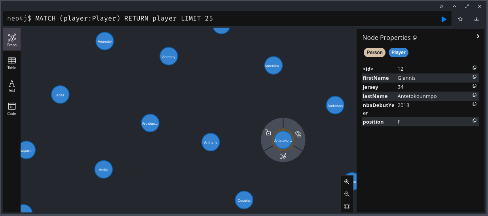
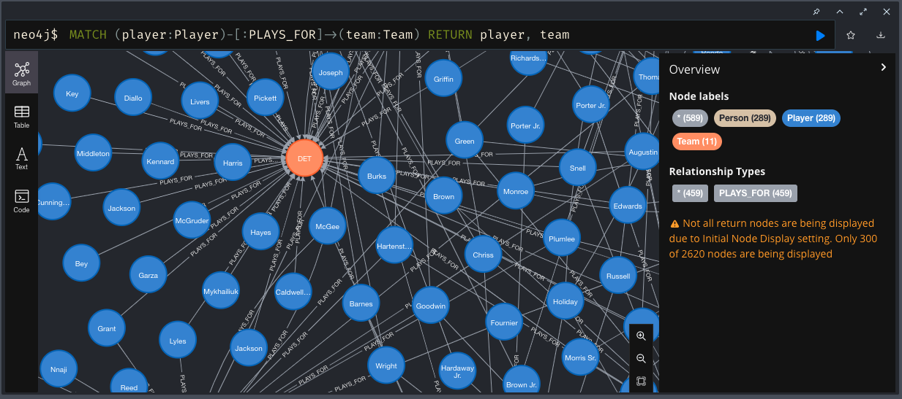
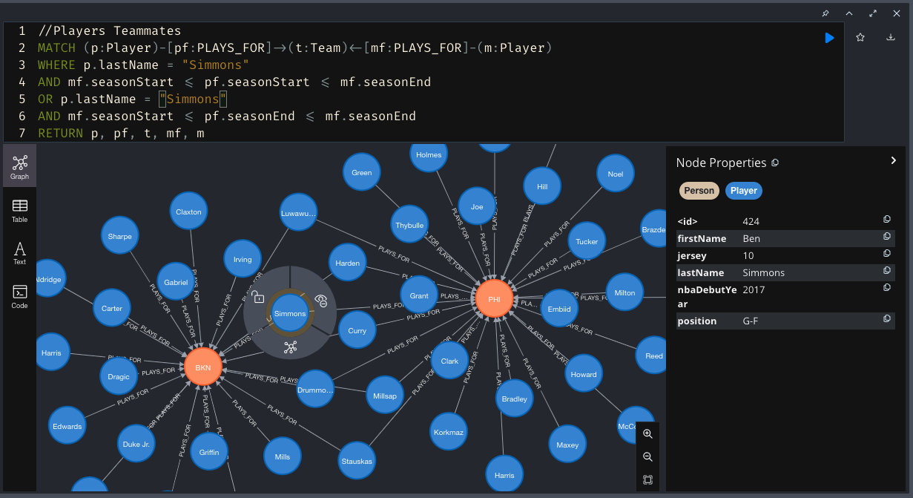

A few years ago I learned that the nba releases json files daily to the public.
Immediately, I jumped on the opportunity to build nba related applications, yet
one thing that always stood out to me about their api is the difficulty
building relationships between its data collections. Take for example this
snippet of json for a collection of players:
```json
[
  {
      "firstName": "Ben",
      "lastName": "Simmons",
      "teams": [
          {
              "teamId": "1610612755",
              "seasonStart": "2016",
              "seasonEnd": "2020"
          },
          {
              "teamId": "1610612751",
              "seasonStart": "2021",
              "seasonEnd": "2021"
          }
      ],
      "draft": {
          "teamId": "1610612755",
          "pickNum": "1",
          "roundNum": "1",
          "seasonYear": "2016"
      },
  }
]
```           
Here we have we have some basic information about the player such as his 
first and last name. We also have some more complex data that provides 
information about his relationship to other entities. For, example this
data shows the teams that Simmons has played for, and for how long ("seasonStart"
and "seasonEnd") but not any more information about each team except for
a team identifier. In the data above we know that Ben Simmons was the number
one pick of the 2016 draft, but the team that he was drafted to cannot
be determined solely by the teamId. This requires us to make another api
request for the NBA Teams:
```json
[
  {
    "nickname": "76ers",
    "urlName": "sixers",
    "teamId": "1610612755",
    "altCityName": "Philadelphia",
    "tricode": "PHI",
    "teamShortName": "Philadelphia",
    "divName": "Atlantic",
    "isAllStar": false,
    "isNBAFranchise": true,
    "confName": "East",
    "fullName": "Philadelphia 76ers",
  }, 
  // ...
]
```
Only once we receive the collection of teams, can we compare the team id of the draft
object against each team object and infer that Ben Simmons was drafted to the
Philadelphia 76ers in 2016.

The usage of ids or keys to show relationships between entities, is a standard
practice because it can be inpractical to fit all of an api's data into a single
response. Generally REST apis will have several endpoints that clients can use, but the
data the client receives from one requests might be too little (such as the example
here) or too much. However, utilizing ids or keys and requiring that clients make
subsequent requests has the benefit of allowing REST apis to scale data and give the
client the most relevant information while keeping response payloads minimal in size.

One downside to this approach is the difficultly clients face modeling many-to-many
relationships. For example if I was interested in knowing which players have played on
the same team as Ben Simmons, then the following process would need to occur:

1. request from the api all players
2. iterate over all players creating a hashmap with the teamId as the key and a
   collection of players as the value
3. iterate and find a player with first name "Ben" and last name "Simmons"
4. iterate over Ben Simmon's teams 
5. utilizing the teamId of the Simmon's team iterate over the hash map value for the team
6. check to see if the player is not Ben Simmons and iterate over the player's teams
7. check to see if the player's teams is the team in question
8. if conditions in step 6 and 7 are met, check to see if the season durations of the
   player and the season duration of Simmons overlap

# Embracing the relationships
I want to answer questions like the question posed in the section above, but with
the complexity abstracted away. This is where I learned about Cypher: the
querying language that takes a similiar declarative style as SQL but without the
complex joins required in relational databases to request related data.
Using, Cypher I'm able to write simple statements about multiple collections, but
first I needed to build out the dataset. To build this set I utilized Neo4j as my graph
database.

Using Go, I built an api scraper that loads the nba data into a Neo4j instance. First,
I focused on loading the NBA teams into the instance.

```go

type TeamsJSON struct {
	League struct {
		Standard []FetchedTeam `json:"standard"`
	} `json:"league"`
}

type FetchedTeam struct {
	FullName       string `json:"fullName"`
	City           string `json:"city"`
	TeamShortName  string `json:"teamShortName"`
	IsNBAFranchise bool   `json:"isNBAFranchise"`
	ConferenceName string `json:"confName"`
	Tricode        string `json:"tricode"`
	DivisionName   string `json:"divName"`
	IsAllStar      bool   `json:"isAllStar"`
	Nickname       string `json:"nickname"`
	URLName        string `json:"urlName"`
	TeamID         string `json:"teamId"`
}

func fetchTeams() ([]FetchedTeam, error) {
	var teams TeamsJSON
	err := fetchAndUnmarshal("nba-url.here.com", &teams)
	if err != nil {
		return nil, err
	}
	return teams.League.Standard, nil
}
```
Then I needed to take this collection and create Graph "Nodes"
```go
  teams, err := fetchTeams()
  if err != nil {
	log.Fatal(err)
  }
  err = createTeams(teams)
  if err != nil {
    log.Fatal(err)
  }
```
Heres what the create function looks like:
```go
func createTeams(ft []FetchedTeam) error {
	driver, err := createDriver()
	if err != nil {
		return err
	}
	defer closeDriver(driver)
	session := createSession(driver)
	defer session.Close()
	created, err := session.WriteTransaction(createTeamsTXWork(ft))
	if err != nil {
		return err
	}
	fmt.Println("created:", created)
	return nil
}
```
In the code snippet above, the Go function creates a neo4j driver,
and begins a session where a transaction is made with the database.
Within transaction, I can write some Cypher the driver will execute.
```go
var createTeamsQuery = `
MERGE (team:Team { fullName: $fullName, shortName: $shortName, city: $city, tricode: $tricode })
`

func createTeamsTXWork(ft []FetchedTeam) neo4j.TransactionWork {
	return func(tx neo4j.Transaction) (interface{}, error) {
		for _, team := range ft {
			params := map[string]interface{}{
				"fullName":  team.FullName,
				"shortName": team.TeamShortName,
				"city":      team.City,
				"tricode":   team.Tricode,
			}
			result, err := tx.Run(createTeamsQuery, params)
			if err != nil {
				return nil, result.Err()
			}
			if result.Next() {
				fmt.Println(result.Record().Values...)
			}
		}
		return true, nil
	}
}
```
Here I create nodes with a label of `Team` with the defining chacteristics
of having a full name, a short name, city, and tricode for each team that is received
from the "fetchTeams" function.

A similar process was done to load the NBA players of the 2021 season. Namely, all
of the players were fetched from the NBA api, a driver and neo4j session was created
and a transaction took place where we created nodes in our graph database of each player.

Using Neo4j's database browser, this is what the player data looks like



At this point the data doesn't look interesting because we only have two kinds of
nodes in our graph database. So, at this point I used the neo4j driver in a similar
process to relate the players to their respective teams. Here is the Cypher query
that was executed per player per team.

```go
var relatePlaysForQuery = `
MATCH (p:Player { firstName: $firstName, lastName: $lastName })
MATCH (t:Team { city: $city, fullName: $fullName })
MERGE (p)-[pf:PLAYS_FOR { seasonStart: $seasonStart }]->(t)
SET pf.seasonEnd = $seasonEnd
RETURN p, t
`
```
What impresses me the most about Cypher how succint the statement is to describe the
relationship between team and player. We describe a one way relationship between
the two nodes, and give it a title `PLAYS_FOR` and we can even pass key-value pairs
to describe the attributes of the relationship like the years that the player had
started and ended their seasons with a team. But what do these relationships
look like visually?



This amount of data with can be overwhelming. However, Neo4j and Cypher not only have
powerful ways of creating many-to-many relationships, but also quickly querying for
specific data. Coming back to the example of finding all of Ben Simmon's potential teammates.



Looking at the data, we gain some interesting insights as well, like all the players who
have played on both teams that Ben Simmons has played for. We can tell that the
dataset is incomplete. Because only the years of season start and end are captured, we
can't distinguish the players who were Ben Simmons teammates from the players that were
involved in a trade for Ben Simmons (James Harden). That will have to be refined...

Hopefully, I've conveyed my excitement for this technology, and will be writing more
about it in future posts!
